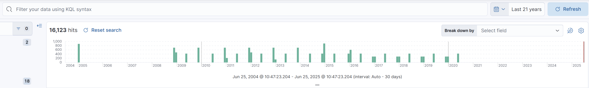
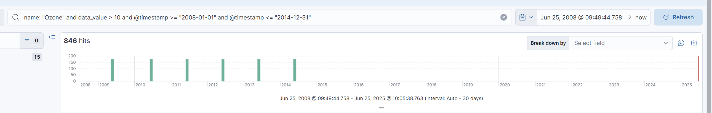
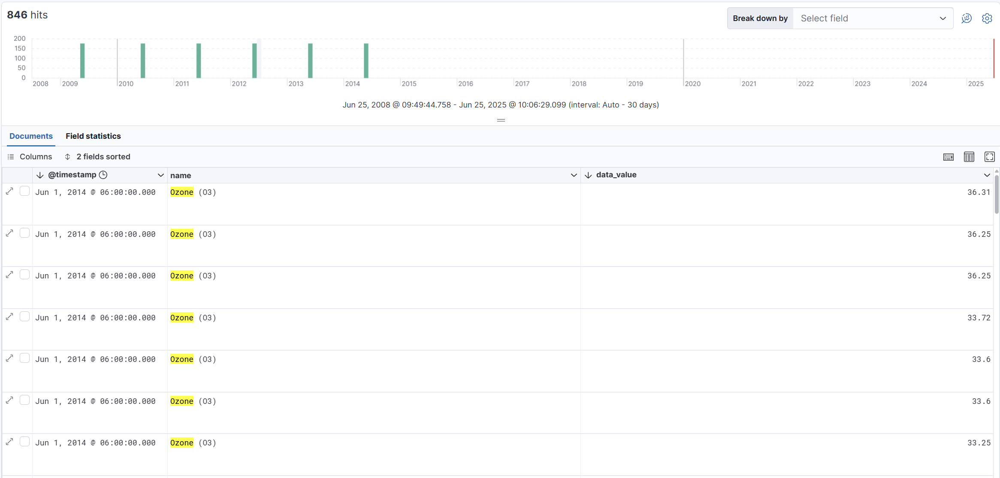
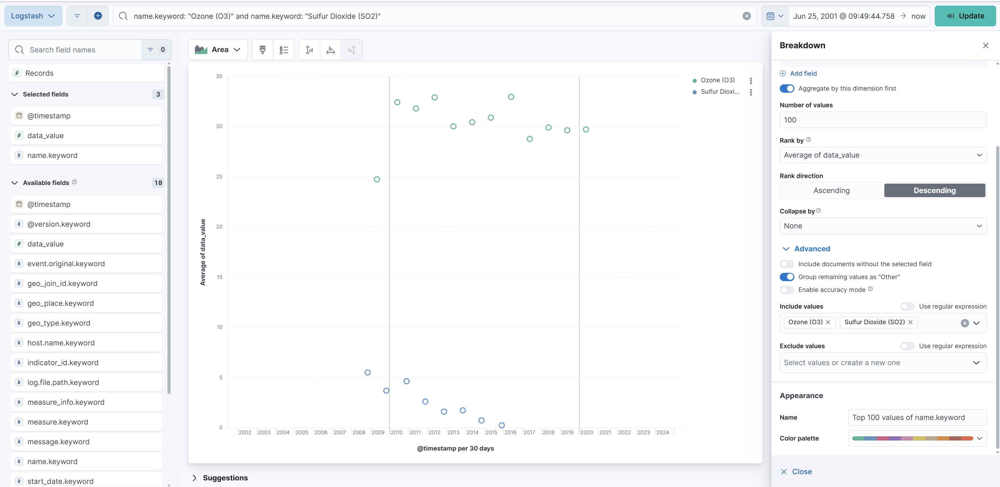
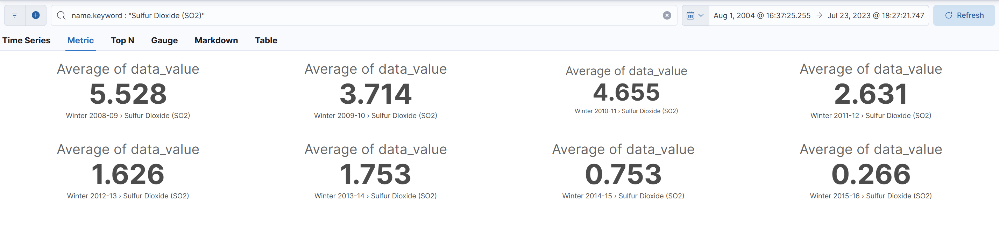
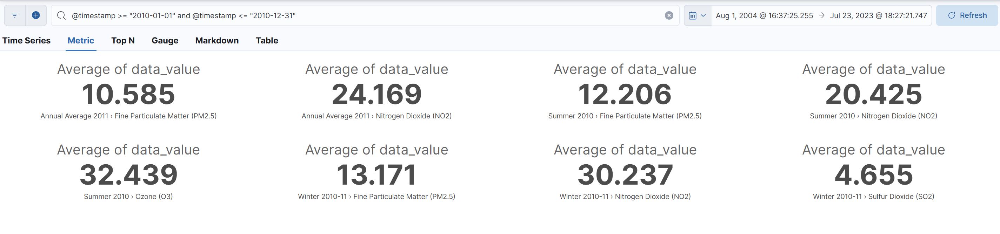
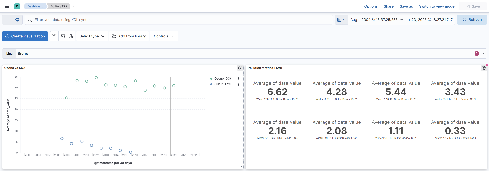

# TP 2

## Exercice 1


## Exercice 2
### 1 - Requête 
```name: "Ozone" and data_value > 10 and @timestamp >= "2008-01-01" and @timestamp <= "2014-12-31"```

Résultat de la requête :


## Exercice 3


## Exercice 4
Recherche dans l'onglet metrics

- Par **Sulfur Dioxide (SO2)** ```name.keyword : "Sulfur Dioxide (SO2)"```


- Par période année **2010** ```@timestamp >= "2010-01-01" and @timestamp <= "2010-12-31"```


## Exercice 5
Filtre sur le dashboard via un lieu
